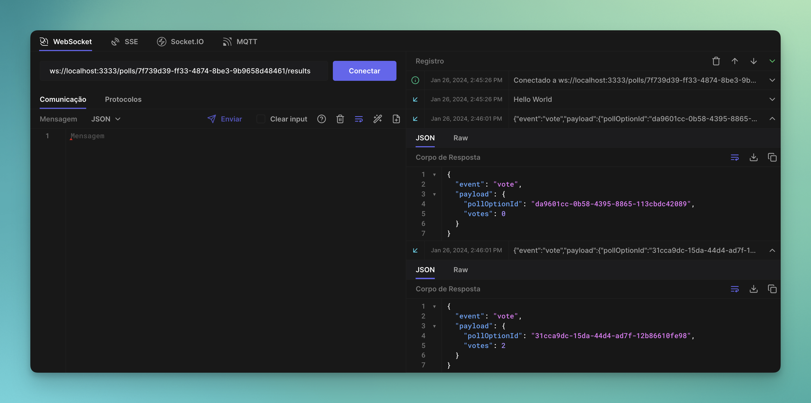

# NLW Expert (Node.js)

A real-time voting system where users can create a poll and other users can cast their votes. The system generates a ranking among the options and updates the votes in real-time.

## Requisites

- Docker;
- Node.js;

## Setup

- Clone the repository;
- Install dependencies (`npm install`);
- Setup PostgreSQL and Redis (`docker compose up -d`);
- Copy `.env.example` file (`cp .env.example .env`);
- Run application (`npm run dev`);
- Test it! (I personally recommend testing with [Hoppscotch](https://hoppscotch.io/)).

## HTTP

### POST `/polls`

Create a new poll.

#### Request body

```json
{
  "title": "Qual a melhor linguagem de programação?",
  "options": [
    "JavaScript",
    "Java",
    "PHP",
    "C#"
  ]
}
```

#### Response body

```json
{
  "pollId": "194cef63-2ccf-46a3-aad1-aa94b2bc89b0"
}
```

### GET `/polls/:pollId`

Return data from a single poll.

#### Response body

```json
{
	"poll": {
		"id": "e4365599-0205-4429-9808-ea1f94062a5f",
		"title": "Qual a melhor linguagem de programação?",
		"options": [
			{
				"id": "4af3fca1-91dc-4c2d-b6aa-897ad5042c84",
				"title": "JavaScript",
				"score": 1
			},
			{
				"id": "780b8e25-a40e-4301-ab32-77ebf8c79da8",
				"title": "Java",
				"score": 0
			},
			{
				"id": "539fa272-152b-478f-9f53-8472cddb7491",
				"title": "PHP",
				"score": 0
			},
			{
				"id": "ca1d4af3-347a-4d77-b08b-528b181fe80e",
				"title": "C#",
				"score": 0
			}
		]
	}
}
```

### POST `/polls/:pollId/votes`

Add a vote to specific poll.

#### Request body

```json
{
  "pollOptionId": "31cca9dc-15da-44d4-ad7f-12b86610fe98"
}
```

## WebSockets

### ws `/polls/:pollId/results`

#### Message

```json
{
  "pollOptionId": "da9601cc-0b58-4395-8865-113cbdc42089",
  "votes": 2
}
```
<!--START_SECTION:footer-->

<br />
<br />

<p align="center">
  <a href="https://discord.gg/rocketseat" target="_blank">
    
  </a>
</p>

<!--END_SECTION:footer-->
